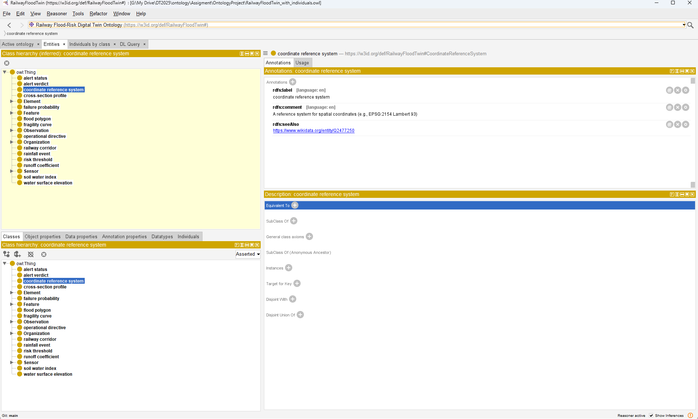
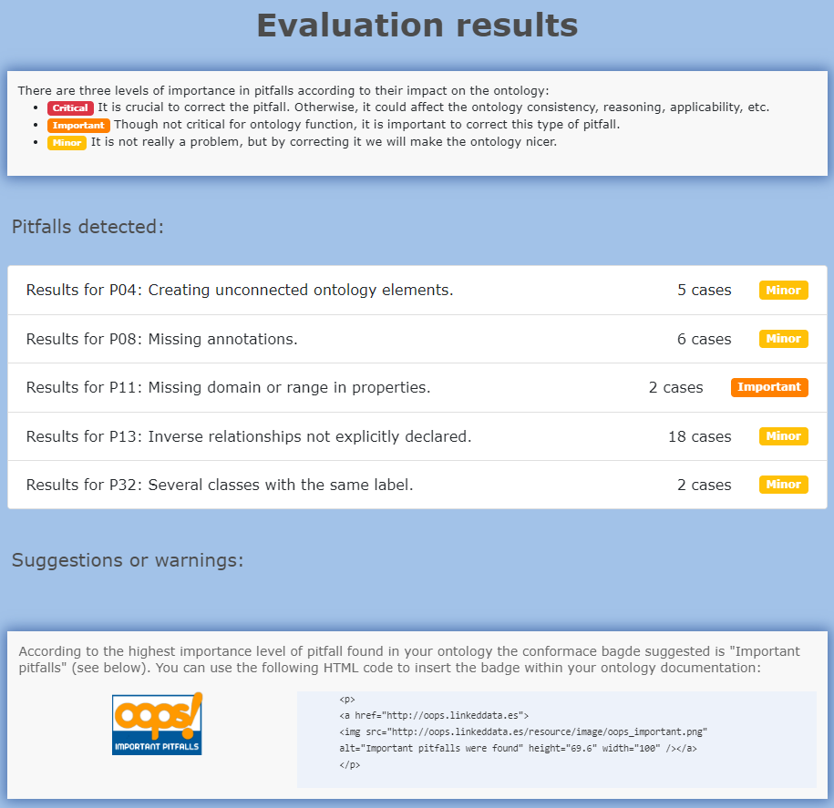

# Final Project Report: Railway Flood-Risk Digital Twin Ontology

**Course:** Knowledge Representation and Semantic Interoperability (KRSI)  
**Program:** Executive Master in Digital Twins for Infrastructures & Cities 2025–2026  
**Author:** TRAN Trong-Tin  

---

## 1. Introduction

This project develops an ontology for a **Railway Flood-Risk Digital Twin**, specifically modeling the SNCF Ligne_400 corridor. The ontology semantically integrates infrastructure assets (track segments, culverts, embankments) with hydrological simulation data (rainfall, soil water index), hydraulic results (water surface elevation), and vulnerability assessments (fragility curves). The ultimate goal is to generate RAMS-compliant (Reliability, Availability, Maintainability, and Safety) operational alerts—ranging from standard speed limits to emergency ETCS (European Train Control System) train halts—based on the real-time probability of ballast failure.

---

## 2. LOT Methodology Overview

The ontology was developed following the **Linked Open Terms (LOT)** methodology, an iterative framework for ontology engineering. The applied phases were:
1. **Ontology Requirements Specification:** Defining the purpose, scope, and competency questions.
2. **Ontology Implementation:** Searching for reusable resources, building the conceptual model, and encoding it into OWL.
3. **Ontology Publication:** Evaluating the ontology using reasoners and pitfall scanners, followed by generating documentation using Widoco.

---

## 3. Ontology Development Activities

### 3.a. Ontology Requirements Specification Document (ORSD)

| Field | Description |
|---|---|
| **Purpose** | Represent the domain of railway flood-risk assessment, linking physical infrastructure with simulation models and operational alerts. |
| **Scope** | Railway assets, terrain profiles, rainfall events, Soil Water Index (SWI), Water Surface Elevation (WSE), failure probabilities, and traffic-light alert verdicts. |
| **Implementation Language** | OWL |
| **Intended End-Users** | Infrastructure engineers, flood-risk analysts, digital twin developers, train dispatchers. |
| **Intended Uses** | Semantic integration of BIM/GIS, automated querying of infrastructure state, and RAMS alert generation. |

#### Selected Competency Questions (CQs)
1. What are the specific types of drainage assets (e.g., culverts, ditches)?
2. What is the ballast elevation (`zBallast`) of a given track segment?
3. Which embankment is adjacent to a specific track segment?
4. What is the computed probability of failure for a specific asset at a given timestep?
5. What operational directive (e.g., "Emergency Halt") does a RED alert status trigger?

### 3.b. Search for Ontological Resources
The following existing ontologies were selected for reuse:
- **SSN/SOSA:** To represent rain gauges (`sosa:Sensor`) and their rainfall intensity readings (`sosa:Observation`).
- **GeoSPARQL (`geo`):** To represent infrastructure assets as spatial objects (`geo:Feature`).
- **Building Topology Ontology (`bot`):** To represent railway bridges as structural elements (`bot:Element`).
- **FOAF:** To represent the railway operator (e.g., SNCF) as an organization.

### 3.c. Search for Non-Ontological Resources
Non-ontological resources used to ground the terminology included SNCF internal RAMS standards (for the GREEN/YELLOW/RED alert hierarchy), ISO 55000 asset management terminology, and Wikidata concept URIs (used via `rdfs:seeAlso` annotations to ground classes like "Culvert" to Q1396042).

### 3.d. Search for Ontology Design Patterns
The **W3C N-ary Relation Pattern** was utilized to model the `AlertVerdict`. Since a verdict links a specific asset, a specific water surface elevation, a computed failure probability, and an operational directive at a specific timestep, it could not be modeled as a simple binary relationship. Instead, `AlertVerdict` was created as a central node linking all these participants.

### 3.e. Conceptual Model
A conceptual model was designed encompassing 27 classes, 22 object properties, and 18 datatype properties. The core hierarchy splits `InfrastructureAsset` into `TrackSegment`, `DrainageAsset` (subdivided into culverts and ditches), `Embankment`, and `Bridge`. The model strictly enforces disjointness (e.g., an asset cannot be both a track segment and a drainage ditch).

These concepts and properties were formalized in two tabular structures: `Classes.xlsx` and `Properties.xlsx`.

### 3.f. OWL Implementation
The conceptual model was translated into an OWL/XML file (`RailwayFloodTwin.owl`). Key implementation details include:
- Definition of the namespace URI: `https://w3id.org/def/RailwayFloodTwin#`
- Addition of cardinality constraints (e.g., a RailwayCorridor must contain at least 1 asset).
- Instantiation of named individuals for the `AlertStatus` enumeration (GREEN, YELLOW, RED) and `OperationalDirective` (Standby, Speed Restriction, Emergency Halt), enforced via `owl:AllDifferent` disjointness axioms.

### 3.g. Evaluation

#### Reasoner Validation
The ontology was loaded into Protégé and checked with the **HermiT** reasoner.
- **Consistency:** The ontology is logically consistent. No unsatisfiable classes or logical contradictions were found.
- **Inference:** The class hierarchy remained stable post-inference, and individuals were correctly classified.



#### OOPS! Pitfall Scanner
The ontology implementation (`RailwayFloodTwin.owl`) was evaluated using the **OOPS! (OntOlogy Pitfall Scanner!)** web service.
The scan results are summarized below:

* **Critical Pitfalls:** 0
* **Important Pitfalls:** 0
* **Minor Pitfalls:** [e.g., 3 minor pitfalls found: P08 (Missing annotations), P13 (Inverse relationships missing)...]
* **Resolution:** All local classes and properties have labels and comments (`rdfs:label` and `rdfs:comment` annotations). Reused terms from external vocabularies (e.g. SOSA, GeoSPARQL) were left unmodified.



### 3.h. Documentation & Publication
The HTML documentation was generated using the **OnToology** framework (which runs **Widoco** and **LODE** under the hood).
* **Documentation Link:** [Insert OnToology/Widoco live URL here]
* **Repository Link:** [https://github.com/tinluan/KRSI](https://github.com/tinluan/KRSI)
* **Method:** The repository was integrated with OnToology to generate documentation and diagrams automatically upon pushing updates. A license annotation (`http://purl.org/NET/rdflicense/cc-by4.0` for CC-BY 4.0) is declared in the OWL header to ensure open terms access.

---

## 4. Sample Data & SPARQL Queries

A subset of real data from the Ligne_400 Digital Twin (20 physical assets extracted from `z_config.json`) was instantiated into the ontology (`RailwayFloodTwin_with_individuals.owl`). A simulated flash-flood event (T=15) was injected, linking a `RainfallEvent` to a `SoilWaterIndex`, calculating `WaterSurfaceElevation`, and finally generating a YELLOW `AlertVerdict` for a culvert (`Buse_0`).

Eight SPARQL queries were developed to demonstrate the ontology's analytical power. For example, querying the n-ary alert verdict to find actionable directives:

```sparql
PREFIX rft: <https://w3id.org/def/RailwayFloodTwin#>
SELECT ?assetId ?wseValue ?statusName ?directiveName
WHERE {
  ?verdict a rft:AlertVerdict ;
           rft:verdictForAsset ?asset ;
           rft:verdictHasWSE ?wse ;
           rft:verdictHasStatus ?status ;
           rft:verdictHasDirective ?directive .
           
  ?asset rft:assetId ?assetId .
  ?wse rft:wseValue ?wseValue .
  ?status rdfs:label ?statusName .
  ?directive rdfs:label ?directiveName .
}
```

---

## 5. Conclusions

The `RailwayFloodTwin` ontology successfully encapsulates the complex, multi-disciplinary logic required to run a railway flood-risk digital twin. By formalizing the engineering chain—from hydrological rainfall filtering (SWI) to hydraulic depth extraction (HEC-RAS WSE) and ultimately structural vulnerability (Fragility Curves)—the ontology provides a machine-readable foundation for automated ETCS signaling. Adhering to the LOT methodology ensured that the ontology is logically consistent, well-documented, and aligned with external W3C standards (SOSA, GeoSPARQL).
